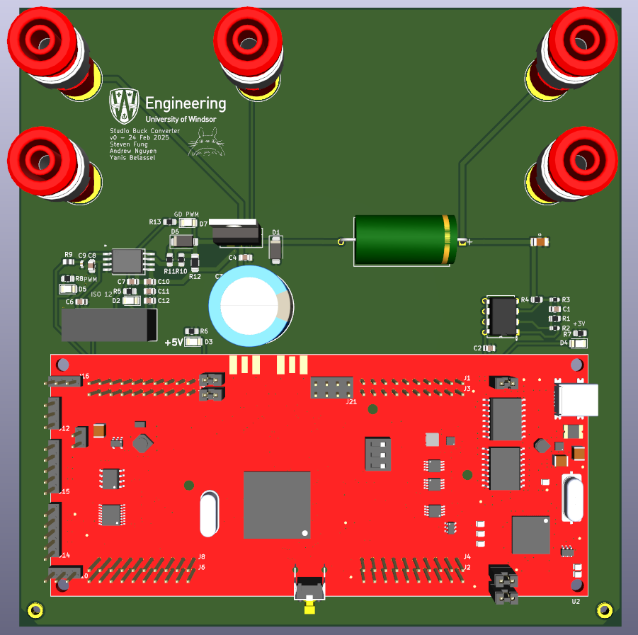

# Custom Buck Converter 
My group designed a unidirectional buck converter with an active low-pass filter and control using a C2000 microcontroller.

The following specifications for this converter are: 

**Input Voltage**: Vi = 36–50V  
**Output Voltage**: Vo = 30V  
**Switching Frequency**: fsw = 10kHz  
**Inductor Current Ripple**: ΔIL = 30% IL  
**Output Voltage Ripple**: ΔVo = 0.5% Vo

The layout, schematic and PCB design of the buck converter was done in KiCAD. 

